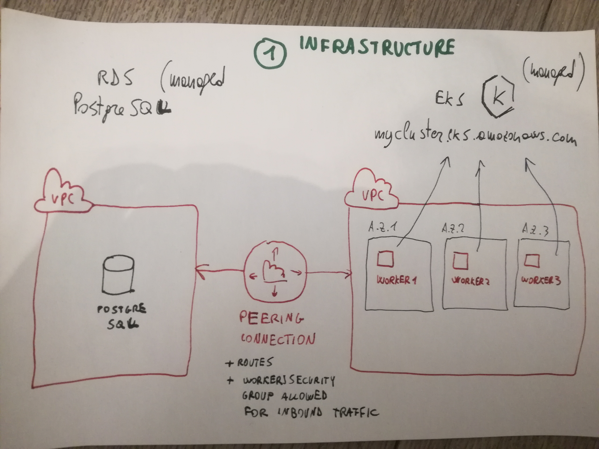
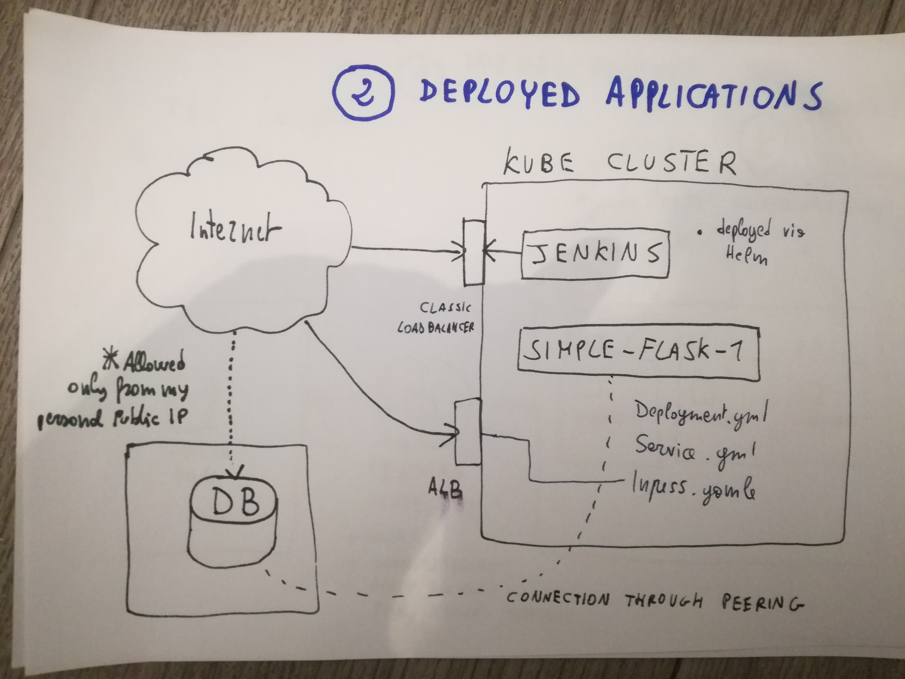

# airlines-example-infra

Just a prototype for an infrastructure setup targeting Kubernetes deployments.

## Architecture: very high level overview

### Infrastructure

The infrastructure for this prototype consists in the following elements:

- En EKS cluster with 3 nodes, one per availability zone, where services and applications should be deployed
- An RDS instance, in a dedicated VPC
- A Peering connection between the two VPCs to allow communication

### Prototype: what applications will be deployed

The Kubernetes cluster will host the following applications:

- a Jenkins instance, which will be used to build an example application, and to deploy it to the kubernetes cluster itself
- A simple api, written in python using the Flask framework, which offers the following capabilities:
  - load from an external datafile information related to airlines; this will be stored in a Postgre DB
  - list the airlines available in the database
  - display information for a specific airline

## What is implemented

I implemented the following:

- I created an EKS cluster on AWS, and installed Jenkins in it (see folder `EKS_01` in this repo)
  - The Jenkins instance is available here: http://a67a9a4783e1b11eaac1002752667983-156899172.eu-west-2.elb.amazonaws.com:8080/
  - *build_and_deploy* is where the pipeline is implemented
  - The cluster and the worker nodes were create using eksctl, which generate Cloudformation stacks
  - the Cloudformation templates are in the `01_EKS/cloudformation` folder
- I created a trivial api in Python/Flask, code and documentation here: https://github.com/aemelius/airlines-example-app
  - the app uses a PostgreSQL database for its backend
  - I setup an RDS backend using terraform on AWS (see folder `02_DB` in this repo) 
- I containerized the application
  - I created a base image to be used for builds (file: `Dockerfile_base`)
  - I used that base image for a containerized build using (file: `Dockerfile`)
- I created a simple Continuous Delivery pipeline for the application
  - the pipeline is defined in a Jenkinsfile:
    - it runs a build and pushes the resulting image to Dockerhub: https://hub.docker.com/repository/registry-1.docker.io/aemel/simple-flask-1/
    - it deploys the newly built image in the Kubernetes cluster where Jenkins is running
  - the deployment consists of a Deployment, a Service and an Ingress Kubernetes resources (folder: `kube`)
  - the Ingress is setup to use an ALB controller, so a Load Balancer is automatically generated and the api is publicly available
    - to see all the airlines stored in the app db: http://afe30604-simpleflask1-simp-a5f3-1053053844.eu-west-2.elb.amazonaws.com/api/v1/airlines
    - to get details of a specific airline: http://afe30604-simpleflask1-simp-a5f3-1053053844.eu-west-2.elb.amazonaws.com/api/v1/airlines/23
    - to trigger the recreation of the database: `curl -vvvX  POST curl -X POST http://afe30604-simpleflask1-simp-a5f3-1053053844.eu-west-2.elb.amazonaws.com/api/v1/load/airlines`
  
## What could be done now

This is just a prototype like project. Many parts of this project are therefore simplified in a way which would not be acceptable in a real-world production project.
Some examples are:
- The api is not implementing any form of authentication/authorization
- Some form of code verification is needed for the application(unit tests, pep8 verification, SonarQube profiles, ...)
  - Ideally, the application should have been developed in a test driven style
- I did not deal with log collection or centralized access; in case of issues with the app, it would be difficult to troubleshoot!
- I used the progressive job number generated by Jenkins for versioning; this means that the build is dependent on the state of the build system, which is not ideal
- Not everything in the setup was automated, in particular:
  - some Jenkins settings have been applied manually:
    - secrets used in the build
    - installation of a few plugins (GitHub, Authorization plugin)
    - setup of the build_and_dpeloy job
    - setup of users
  - The peering between the Kubernetes VPC and the RDS VPC has been create dmanually
- No TLS certificates have been configured, so everything is served via http and not https
- The changes required to configure AWS to support ALB Ingress controllers have been applied manually (https://docs.aws.amazon.com/eks/latest/userguide/alb-ingress.html)
- the database schema has been initialized manually

